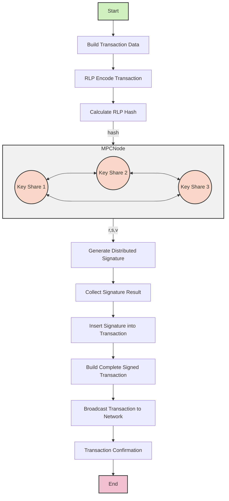

# Binance TSS Project

This project serves as a demonstration for Threshold Signature Scheme (TSS).

## Overview

The Project is designed to showcase the implementation and functionality of threshold signature schemes, which are crucial for enhancing security in distributed systems. This project leverages key technologies and libraries to provide a robust demonstration of TSS capabilities.



## Related Technologies

- [Thorchain](https://gitlab.com/thorchain/thornode/-/tree/v3.7.0/bifrost/tss/go-tss?ref_type=tags)
- [Thorchain TSS](https://gitlab.com/thorchain/tss/tss-lib/-/tree/v0.1.5)
- [TSS Library](https://github.com/bnb-chain/tss-lib): A library that provides the core functionalities for implementing threshold signature schemes.

## Getting Started

### Start Server
To run the Project, execute the following commands in your terminal:


```bash
# thorpub1addwnpepq07lfyrczz5ltk2x9gdwp8lwuk4jqhfj0x9sllxr09zzqg0cf3dm78wtzae
go run cmd/main.go --tsshttp-port 127.0.0.1:8081 --pretty-log --p2p-port 6671 --home ./data/node1 --peer /ip4/127.0.0.1/tcp/6672/p2p/16Uiu2HAmPLe7Mzm8TsYUubgCAW1aJoeFScxrLj8ppHFivPo97bUZ --peer /ip4/127.0.0.1/tcp/6673/p2p/16Uiu2HAm7JvHh9HhWUy3sVBYzPcVJTmDFbGxQ1dnBWgCRzfN1TXM
# node secret key: NmI4NmIyNzNmZjM0ZmNlMTlkNmI4MDRlZmY1YTNmNTc0N2FkYTRlYWEyMmYxZDQ5YzAxZTUyZGRiNzg3NWI0Yg==

# thorpub1addwnpepqw0t6d6waga7lh05dwa3st3fr7m3nmsmwpdsk7qzzcgr36ma4zsrvlg06u0
go run cmd/main.go --tsshttp-port 127.0.0.1:8082 --pretty-log --p2p-port 6672 --home ./data/node2 --peer /ip4/127.0.0.1/tcp/6671/p2p/16Uiu2HAmVkKntsECaYfefR1V2yCR79CegLATuTPE6B9TxgxBiiiA --peer /ip4/127.0.0.1/tcp/6673/p2p/16Uiu2HAm7JvHh9HhWUy3sVBYzPcVJTmDFbGxQ1dnBWgCRzfN1TXM
# node secret key: ZDQ3MzVlM2EyNjVlMTZlZWUwM2Y1OTcxOGI5YjVkMDMwMTljMDdkOGI2YzUxZjkwZGEzYTY2NmVlYzEzYWIzNQ==

# thorpub1addwnpepq2cfzken8ynd2vuv4kaxzstyexd7sdvj5y7chhktdanety7prduasxq3caf
go run cmd/main.go --tsshttp-port 127.0.0.1:8083 --pretty-log --p2p-port 6673 --home ./data/node3 --peer /ip4/127.0.0.1/tcp/6671/p2p/16Uiu2HAmVkKntsECaYfefR1V2yCR79CegLATuTPE6B9TxgxBiiiA --peer /ip4/127.0.0.1/tcp/6672/p2p/16Uiu2HAmPLe7Mzm8TsYUubgCAW1aJoeFScxrLj8ppHFivPo97bUZ 
# node secret key: NGUwNzQwODU2MmJlZGI4YjYwY2UwNWMxZGVjZmUzYWQxNmI3MjIzMDk2N2RlMDFmNjQwYjdlNDcyOWI0OWZjZQ==

```

### Generate Key

[api_test.go](test/api_test.go)

###  Sign

[api_test.go](test/api_test.go)

